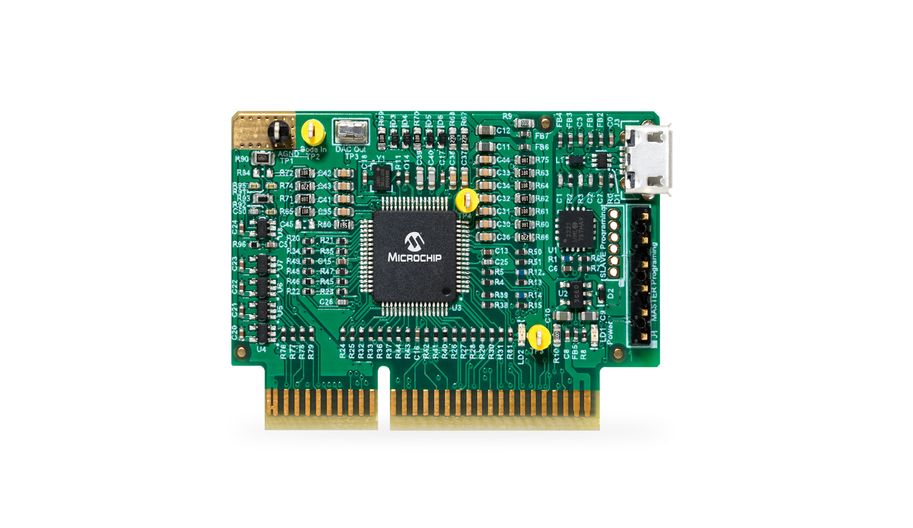
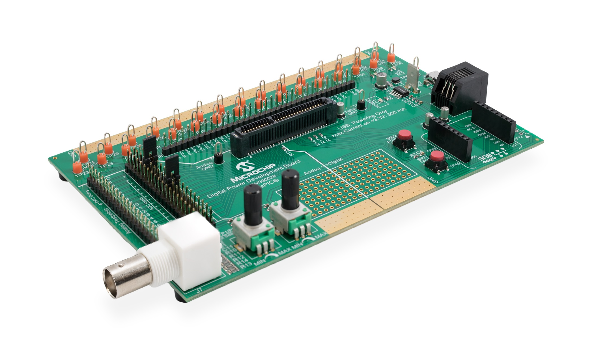
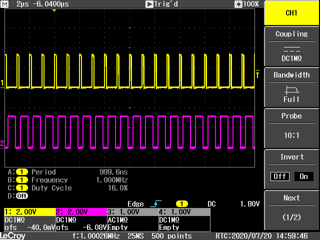
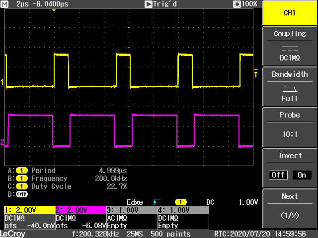

# dsPIC33C High-Resolution PWM Configuration I

## Complementary PWM Waveform Generation

- - -

## Summary

Learn how to use the High Resolution PWM Module of dsPIC33C MP devices

**Lab 1: Complementary Waveform Generation**
Code example for dsPIC33CK and dsPIC33CH devices introducing the basic configuration of the high-resolution PWM module using one PWM generator channel generating a single, complementary PWM waveform

- - -

## Related Documentation

- [dsPIC33CK256MP508 Family Data Sheet](https://www.microchip.com/DS70005349)
- [dsPIC33CK256MP508 Family Silicon Errata and Data Sheet Clarification](https://www.microchip.com/80000796)

Alternative Controller Plug-In Module:

- [dsPIC33CH512MP508 Family Data Sheet](http://www.microchip.com/70005371)
- [dsPIC33CH512MP508 Family Silicon Errata and Data Sheet Clarification](http://www.microchip.com/80000805)

**Please always check for the latest data sheets on the respective product websites:**

- [dsPIC33CK256MP508 Family](https://www.microchip.com/dsPIC33CK256MP508)
- [dsPIC33CH512MP508 Family](https://www.microchip.com/dsPIC33CH512MP508)

## Software Used

- [MPLAB&reg; X IDE v6.20](https://www.microchip.com/mplabx)
- [MPLAB&reg; XC-DSC Compiler v3.00](https://www.microchip.com/xc16)
- [MPLAB&reg; Code Configurator v5.7.0](https://www.microchip.com/mcc)

## Hardware Used

- Digital Power Development Board, Part-No. [DM330029](https://www.microchip.com/DM330029)
- dsPIC33CK Digital Power Plug-In Module (DP PIM), Part-No. [MA330048](https://www.microchip.com/MA330048)
- Alternative Plug-In Modules:
  - dsPIC33CK512MP606 Digital Power Plug-In Module (DP PIM), Part-No. [EV12Y79A](https://www.microchip.com/EV12Y79A)
  - dsPIC33CH Digital Power Plug-In Module (DP PIM), Part-No. [MA330049](https://www.microchip.com/MA330049)

## Supported/Compatible Target Device Families

- [dsPIC33CK64MP105](https://www.microchip.com/dsPIC33CK64MP105)
- [dsPIC33CK256MP508](https://www.microchip.com/dsPIC33CK256MP508)
- [dsPIC33CK512MP608](https://www.microchip.com/dsPIC33CK512MP608)
- [dsPIC33CK1024MP710](https://www.microchip.com/dsPIC33CK1024MP710)
- [dsPIC33CH512MP508](https://www.microchip.com/dsPIC33CH512MP508)
- Code compatible with all Single and Dual Core dsPIC33C MP families of devices

- - -

## Setup

- Plug-In the dsPIC33CK Digital Power Plug In Module into the Digital Power Development Board PIM socket J1
- Open and compile the firmware and program the DSC

## Operation

After the device has been programmed and the MCU starts up, PWM generator #3 is generating a 200 kHz complementary waveform at the PWM3H/PWM3L outputs. 

*200 kHz Switching Frequency Output*

By pressing the on-board push button *USER* on the Digital Power Development Board, the switching frequency is toggled between the initial 200 kHz and 1 MHz.

*1 MHz Switching Frequency Output*

Please refer to section *FIRMWARE QUICK-START GUIDE* below for more information on the initialization process and code structure.

- - -

## FIRMWARE QUICK-START GUIDE

This code example builds on previous code examples showing how to use Microchip Code Configurator (MCC) to set up device clock domains.

Although MCC also supports configuration tools for the High Resolution PWM module, PWM configuration in this example builds on generic peripheral drivers to help users better understand the peripheral architecture and key aspects of specific configurations and operating modes.

In each PWM example code project the PWM configuration procedure is located in the user file pwm.c, where each register bit required to achieve/enable the specific function or mode of interest is set and its function described with comments.
Once users are familiar with the architecture, features and capabilities, both configuration options (generic peripheral library or MCC) may be used.

### a) Project Directory Structure

The project contains two sub-directories

- config: location of all hardware abstraction header files
- drivers: location of generic peripheral drivers
- MCC Generated Files: all device configuration files auto-generated by MCC
- root: application user code

On the hard drive, main.c/h are located in the MPLAB&reg; X project directory.
All other user files, incl. peripheral drivers, are located in the sub-directory *sources*.
Files generated by MCC are always located in their own sub-directory *mcc_generated-files*

### b) Using the generic PWM peripheral driver

The PWM peripheral driver files p33c_pwm.c/h provide data structures representing the Special Function Register (SFR) sets of PWM generators and the PAM base module. These 'virtual' PWM objects are used to load, read and modify PWM generator configurations without the need to hard-coded instructions, which would make the code hard to migrate from one peripheral to another or even across devices.
To simplify PWM configurations, in these examples, each register is reset to a known default state before the user configuration of interest is set. Thus, only the register setting which really matter for a certain features/function are shown.

To learn more about the generic PWM driver, its supported features and intended use cases, please read the comments inside p33c_pwm.c.

### c) Executing the Code Example

This code has been written to automatically start up and perform the function of interest. Please read the demo instructions on top of file main.c to learn more about the code example, test points, expected signals and demo mode operation.

- - -

&copy; 2024, Microchip Technology Inc.
